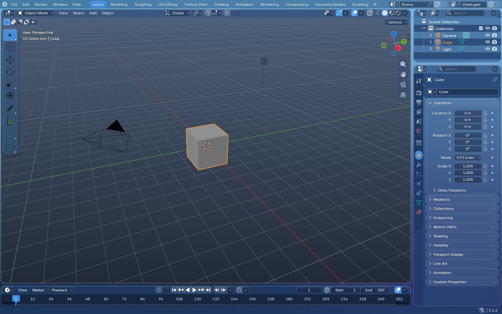
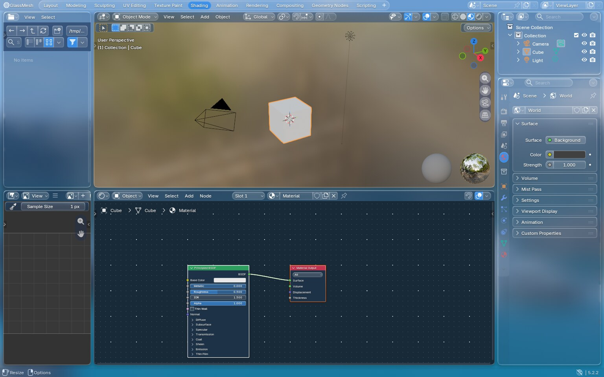
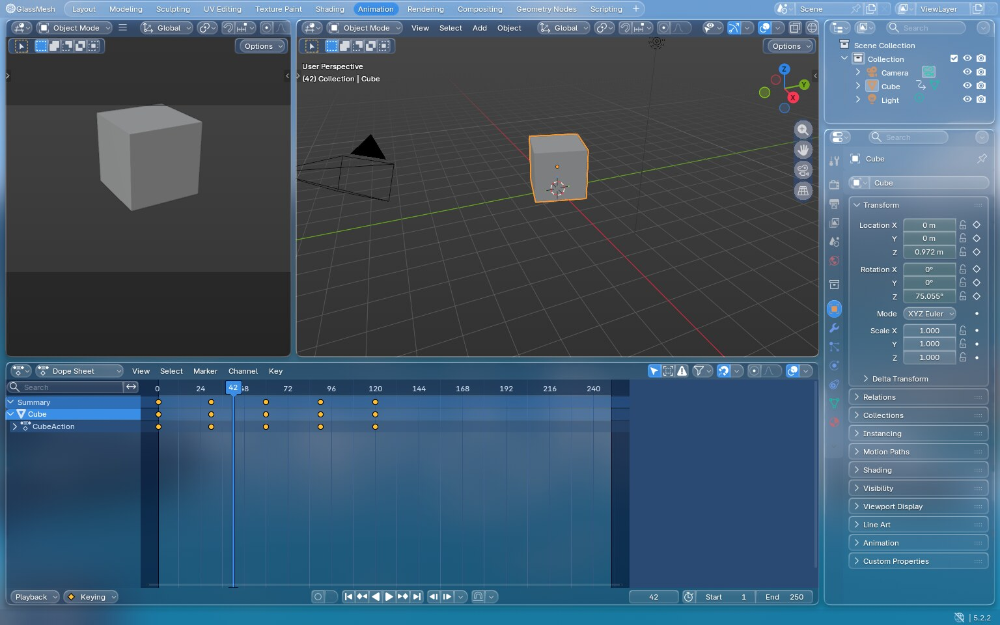
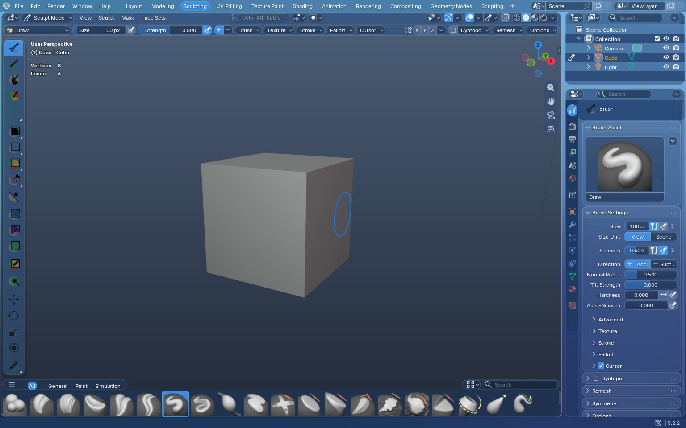
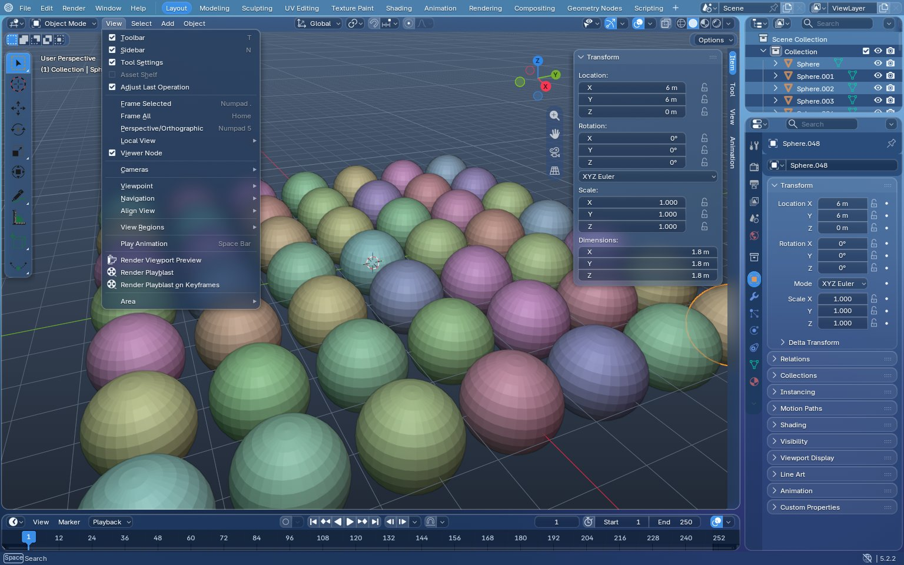
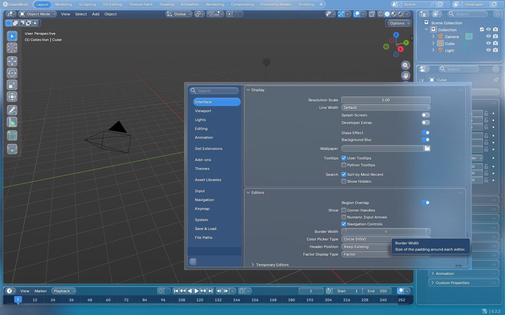
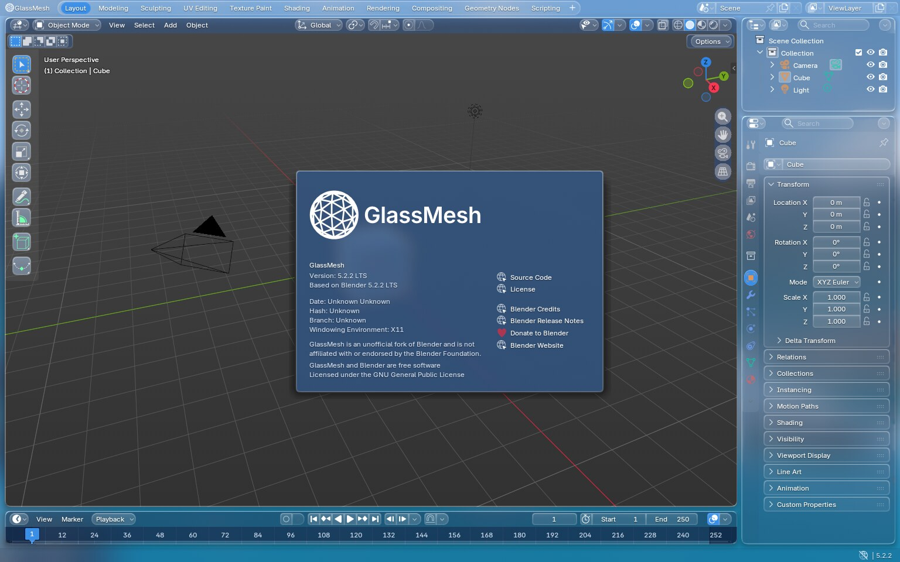
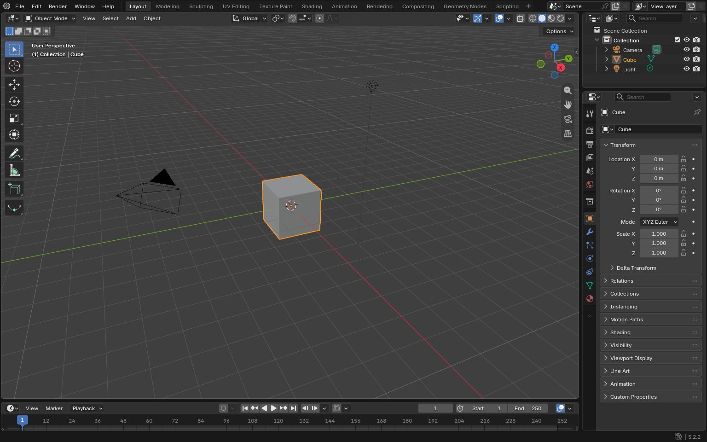

# GlassMesh – Implementation notes

GlassMesh is Blender 5.2.2 LTS (`blender-v5.2-release`) with a "Liquid Glass" style interface and
GlassMesh branding. This document lists what was changed and where, what could not be done, and
what to test first. The reasons behind the choices are in [DECISIONS.md](DECISIONS.md).

GlassMesh is an unofficial fork of Blender and is not affiliated with or endorsed by the Blender
Foundation.

## Preview

Screenshots from the verification build (Linux, software OpenGL, so a real GPU looks the same but
sharper and faster). The viewport shows Blender's default scene.

| | |
|---|---|
|  |  |
| Layout | Shading |
|  |  |
| Animation | Sculpting |
|  |  |
| Frosted menu & side-bar over a colorful scene | Preferences, with the new Glass settings |
|  |  |
| About GlassMesh | Glass effect off + Blender Dark preset = classic look |

## What changed

### 1. Glass interface

**Preferences** – *Interface > Display > Glass*: **Glass Effect** and **Background Blur**.

- `source/blender/makesdna/DNA_userdef_types.h` – `UserDef.glass_flag` (`USER_GLASS_DISABLE`,
  `USER_GLASS_NO_BLUR`), stored in existing padding.
- `source/blender/makesrna/intern/rna_userdef.cc` – `use_glass_effect`, `use_glass_blur`.
- `scripts/startup/bl_ui/space_userpref.py` – the two settings, and the glass style preferences
  navigation.

**Shaders** (`source/blender/gpu/`)

- `shaders/infos/gpu_shader_2D_glass_infos.hh`, `shaders/gpu_shader_2D_glass_*.glsl` – two new
  built-in shaders: `GPU_SHADER_2D_GLASS_BACKDROP` (frosted blur + tint + grain, masked by a region's
  alpha) and `GPU_SHADER_2D_GLASS_WALLPAPER` (procedural wallpaper, also usable with the editor-gap
  geometry).
- `shaders/gpu_shader_2D_widget_base.bsl.hh` – rim highlight and sheen for all widgets.
- `GPU_shader_builtin.hh`, `intern/gpu_shader_builtin.cc`, `CMakeLists.txt` – registration.

**Window compositing** (`source/blender/windowmanager/`)

- `intern/wm_draw_glass.cc` (new) – wallpaper, window capture, blurred backdrop per region.
- `intern/wm_draw.cc` – draws the wallpaper, blends translucent editors, and draws the frosted
  backdrop under overlapping regions (headers, tool-bars, side-bars) and floating regions (menus,
  popups, tool-tips).
- `wm_draw.hh`, `intern/wm_init_exit.cc` (GPU resources freed at exit), `CMakeLists.txt`.

**Interface drawing** (`source/blender/editors/`)

- `include/UI_glass.hh` (new) – glass settings (radius, blur radius, rim/sheen strength) and helpers.
- `interface/interface_glass.cc` (new) – wallpaper palette (from the theme's *Editor Border* color).
- `interface/interface_widgets.cc` – rim & sheen defaults, pill tabs, no double highlights on
  multi-pass widgets.
- `interface/interface_draw.cc` – `draw_roundbox_4fv_glass()`, all 12 widget parameters uploaded.
- `interface/interface_panel.cc` – panel rims, glass cards for panels over the viewport, the
  tool-bar glass pill.
- `interface/interface_button_sections.cc` – header button groups as floating glass pills.
- `interface/resources.cc` – translucent (pre-multiplied) region background clears with glass.
- `screen/screen_draw.cc`, `screen/screen_intern.hh` – editor gaps show the wallpaper, rim on
  editor outlines, larger corner radius.

**Theme**

- `release/datafiles/userdef/userdef_default_theme.c` – the GlassMesh default theme, generated by
  `tools/glassmesh/apply_glassmesh_theme.py` (edit the palette there and re-run it).
- `scripts/presets/interface_theme/Blender_Dark.xml` – now contains Blender 5.2's default colors
  (the classic look), `GlassMesh.xml` – the built-in default.
- `source/blender/blenkernel/intern/blendfile.cc` – factory border width 4.

### 2. Branding (user-facing only)

- **Name / window title / app menu:** `windowmanager/intern/wm_window.cc`,
  `intern/ghost/intern/GHOST_SystemCocoa.mm` (macOS menu), `GHOST_SystemWin32.cc` (error dialogs),
  `scripts/startup/bl_ui/space_topbar.py`.
- **Splash & About:** `windowmanager/intern/wm_splash_screen.cc`, `scripts/startup/bl_operators/wm.py`,
  splash image `release/datafiles/glassmesh/splash.png` (used by
  `editors/datafiles/CMakeLists.txt`).
- **Command line:** `source/creator/creator_args.cc` (`--version`, `--help`, startup line).
- **Logo & icons:** `tools/glassmesh/make_brand_assets.py` generates
  `release/datafiles/glassmesh/glassmesh_logo.svg`, the splash, the in-app logos
  (`release/datafiles/icons_svg/blender.svg`, `blender_logo_large.svg`), the Linux icons
  (`release/freedesktop/icons/...`), `release/windows/icons/winblender.ico`,
  `release/darwin/Blender.app/Contents/Resources/glassmesh_icon.icns` and the X11 window icon
  (`intern/ghost/intern/GHOST_IconX11.hh`).
- **Executable names** (`glassmesh`, `glassmesh.exe`, `glassmesh-launcher.exe`, `GlassMesh.app`):
  `CMakeLists.txt` (`GLASSMESH_EXE_NAME`, `GLASSMESH_APP_NAME`, Windows app ID),
  `source/creator/CMakeLists.txt`, `tests/CMakeLists.txt`, `build_files/cmake/testing.cmake`,
  `GNUmakefile`, `build_files/windows/find_blender.cmd`, `intern/cycles/app/CMakeLists.txt`,
  `source/creator/blender_launcher_win32.c`, `source/blender/blenlib/intern/system_win32.cc`,
  `source/blender/blenlib/intern/winstuff.cc`, `intern/ghost/intern/GHOST_WindowWin32.cc`.
- **Platform metadata:** `release/windows/icons/winblender.rc` (version info),
  `release/darwin/Blender.app/Contents/Info.plist` (+ thumbnailer plist, `platform_apple.cmake`,
  `blendthumb/src/thumbnail_provider.mm`), `release/freedesktop/blender.desktop` (installed as
  `glassmesh.desktop`), `release/bin/blender-launcher` (installed as `glassmesh-launcher`),
  `intern/ghost/intern/GHOST_SystemX11.hh` / `GHOST_SystemWayland.cc` (window class / app ID),
  `scripts/modules/_bpy_internal/platform/freedesktop.py` (Linux "register" uses GlassMesh names).
- **Separate config & cache folders:** `intern/ghost/intern/GHOST_SystemPaths{Unix,Win32,Cocoa}`,
  `source/blender/blenkernel/intern/appdir.cc`.
- **Bug reports** go to the GlassMesh GitHub issues:
  `scripts/modules/_bpy_internal/system_info/url_prefill_{runtime,startup}.py`.
- **Docs:** `README.md`, `release/text/readme.html` (shipped with builds), this file,
  `DECISIONS.md`.
- **Git LFS:** `.lfsconfig` (upstream LFS objects from projects.blender.org), `.gitattributes` and
  `.gitignore` (GlassMesh's own binary files are stored directly in git).

Not changed: internal code, module and target names, the Python API (`bpy`), the `.blend` file
format and its identifiers, all copyright notices and license files.

## What I could not do (and why)

- **Build or run on Windows and macOS.** Only a Linux build was possible here. The Windows- and
  macOS-only changes (executable names, launcher, file registration, `Info.plist`, config folder
  code in `GHOST_SystemPathsWin32.cc` / `GHOST_SystemPathsCocoa.mm`) are small and were checked by
  reading, but never compiled.
- **Full Blender build with its official libraries.** The network here blocks
  `projects.blender.org`, so Blender's pre-compiled libraries and Git LFS files could not be
  downloaded. A "lite" build (no Cycles, FFmpeg, USD, ...) was made with a mix of system and
  official release libraries instead. None of the GlassMesh changes touch the disabled features.
  The changed C/C++ files compile without warnings.
- **Test on real GPUs.** Everything was checked with Mesa's software OpenGL renderer (llvmpipe).
  The **Metal** (macOS) and **Vulkan** backends were not tested. The frosted backdrop copies the
  window frame-buffer (`GPU_framebuffer_blit`), and on those backends that path is the first thing
  to check.
- **See-through to the desktop.** The mockups show the OS desktop behind the Blender window. Blender
  can't draw into a transparent OS window, so GlassMesh draws its own soft wallpaper instead.
- **iOS style toggle switches** (seen in some mockups) were not added. Checkboxes are restyled
  instead, see DECISIONS.md #14.
- **macOS 26 Liquid Glass app icon (`Assets.car`).** Compiling an asset catalog needs Xcode. The
  `.icns` icon is used on all macOS versions.
- **Packaging templates** for Snap, Flatpak and MSIX (`release/freedesktop/snap`,
  `release/windows/msix`) still describe Blender. They are not used by `make`, only by Blender's
  own release infrastructure.
- **Translations:** new texts (Glass settings, disclaimer...) are English only.
- **"Blender" in ordinary interface texts** (for example "A restart of Blender is required",
  tool-tips, the manual) was left as is. The app's name is changed where it presents itself (see
  above), but renaming hundreds of texts would break their translations and make every future
  Blender update conflict.

## What to test first

1. **Build on each platform** with the README instructions (`make update && make`). Watch
   especially for the executable names (`glassmesh.exe` / `GlassMesh.app`) and that the app starts.
2. **First start:** splash screen (GlassMesh artwork), window title "... - GlassMesh 5.2.2 LTS",
   *About GlassMesh* in the app menu, `glassmesh --version`.
3. **Config separation:** preferences are saved to the GlassMesh folder, a regular Blender
   installation keeps its own settings.
4. **Glass in the 3D viewport:** header, tool-bar, side-bar (N) and menus over the viewport show a
   frosted blur of the scene. Orbit the view and open menus to check for flicker or lag.
5. **GPU backends:** switch *Preferences > System > Backend* (OpenGL / Vulkan, Metal on macOS) and
   repeat step 4. If the blur breaks on one backend, turn off *Background Blur* and report it.
6. **Toggles:** switch *Glass Effect* and *Background Blur* off and on, everything should update
   right away. Then pick the *Blender Dark* theme preset with glass off, it should look like Blender.
7. **Other editors:** Outliner, Properties, node editors, Dope Sheet/Graph Editor, Text Editor,
   Preferences window, file browser. Look for readability and drawing glitches.
8. **HiDPI / scaling:** *Resolution Scale* 1.0 and 2.0, a Retina/4K display, several windows,
   resizing windows.
9. **Files:** open and save `.blend` files and make sure they still work in official Blender 5.2
   (and the other way round).
10. **Desktop integration:** *Preferences > System > Operating System Settings > Register* (Linux
    and Windows), then check the `.blend` file association, the dock/taskbar icon and window
    grouping. **Windows:** taskbar pinning and `glassmesh-launcher.exe`.

## Possible follow-ups

- iOS style switches for some checkboxes, if a clear rule for which ones can be agreed on.
- A user setting for the wallpaper (colors, or an image).
- Regenerating the macOS `Assets.car` in Xcode from `glassmesh_logo.svg`.
- Offering to import settings from a regular Blender installation on first start.
